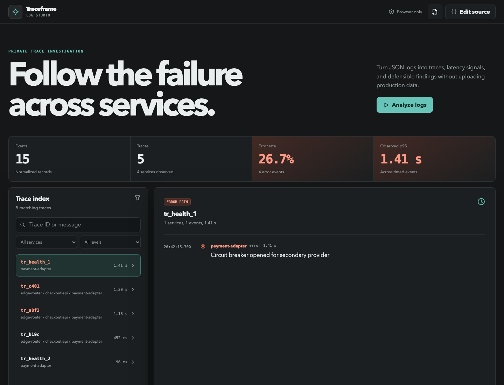
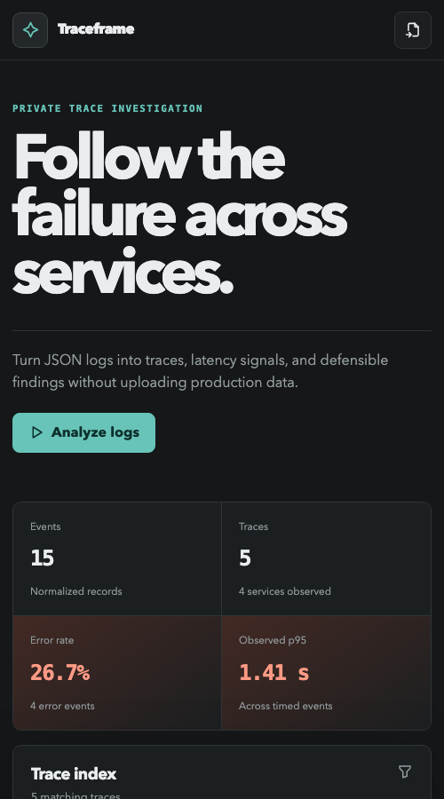

# Traceframe Log Studio



Traceframe turns structured JSON logs into a private, trace-centric investigation workspace. It normalizes common logging conventions, groups events by correlation identity, exposes cross-service failure paths, summarizes observed latency and errors, and produces a portable findings report without uploading production data.

## Why this project exists

Raw logs preserve facts but rarely preserve a readable causal path. Traceframe is a focused bridge between a text file and a full observability platform. It is useful during local debugging, support handoff, incident review, and any investigation where a sensitive sample should stay off third-party servers.

## Product flow

1. Paste NDJSON, paste a JSON array, import a `.json`, `.ndjson`, or `.log` file, or load the checkout sample.
2. Analyze the source locally in a Web Worker.
3. Search and filter traces by service, level, trace ID, or message.
4. Follow an ordered event path across services and inspect duration signals.
5. Review heuristic findings and per-service observed p95 latency.
6. Export a Markdown investigation summary.

## Features

- NDJSON and JSON-array input
- Alias normalization for timestamps, levels, services, messages, trace IDs, and duration fields
- Trace grouping with cross-service paths and wall-clock fallback duration
- Search plus service and severity filters
- Error-rate, trace-count, service-count, and p95 investigation metrics
- Per-service latency chart with error-aware color treatment
- Deterministic heuristic findings for high latency, repeated errors, and multi-service failure paths
- Local persistence and browser-only processing
- Markdown findings export
- Empty, loading, no-results, success, malformed-line, invalid-record, and worker-error states
- Responsive layout, semantic controls, keyboard focus, and reduced-motion support

## Technology

- Vue 3 Composition API and TypeScript 6
- Vite 8
- Web Workers
- Chart.js 4
- Tabler Icons
- Vitest, Vue TSC, ESLint 10, and Prettier
- GitHub Actions CI

## Architecture

```text
JSON / NDJSON source
    |
    v
analyze.worker.ts
    |
    v
parser.ts
    +--> field normalization
    +--> trace and service grouping
    +--> latency and error summaries
    +--> heuristic findings
    |
    v
Vue investigation workspace
    +--> trace filters and detail path
    +--> Chart.js service view
    +--> Markdown export
```

The parser and analyzer are framework-independent and tested directly. The Vue layer owns navigation and presentation, while repeated user-triggered analysis runs inside a worker so large imports do not block interaction.

## Accepted fields

Traceframe intentionally accepts several common aliases:

| Meaning        | Accepted fields                                     |
| -------------- | --------------------------------------------------- |
| Timestamp      | `timestamp`, `time`, `ts`                           |
| Level          | `level`, `severity`                                 |
| Service        | `service`, `component`, `app`                       |
| Message        | `message`, `msg`                                    |
| Trace identity | `traceId`, `trace_id`, `correlationId`, `requestId` |
| Duration       | `durationMs`, `duration_ms`, `latency`              |

Additional fields remain available in each entry's normalized attributes object.

## Setup

Requirements: Node.js 22 or newer and npm 10 or newer.

```bash
git clone https://github.com/Decker7/traceframe-log-studio.git
cd traceframe-log-studio
npm install
npm run dev
```

## Commands

| Command                | Purpose                                     |
| ---------------------- | ------------------------------------------- |
| `npm run dev`          | Start the development server                |
| `npm run build`        | Type-check and create the production bundle |
| `npm run preview`      | Preview the production bundle               |
| `npm test`             | Run parser and analysis tests once          |
| `npm run lint`         | Run ESLint with zero warnings allowed       |
| `npm run typecheck`    | Run Vue and TypeScript project checks       |
| `npm run format`       | Format the repository                       |
| `npm run format:check` | Verify formatting without edits             |

## Verification

The release was checked with:

```bash
npm run format:check
npm run lint
npm run typecheck
npm test
npm run build
npm audit --omit=dev
```

Current test suite: 5 passing parser and analysis tests. The rendered production experience scored 100 for Performance, Accessibility, and Best Practices in a local Lighthouse audit.

## Responsive preview



## Privacy and security

- Logs are parsed in the browser and are never uploaded.
- There are no accounts, analytics, API keys, or external data services.
- Imported data is treated as inert JSON; log messages are rendered as text, not HTML.
- Malformed input returns a contextual line or record error without replacing the last valid analysis.

## Limitations

- Traceframe is a local investigation aid, not a production observability backend.
- It does not ingest live streams, persist multiple workspaces, or query remote log stores.
- Heuristic findings are deterministic clues, not root-cause proof.
- The current parser expects each record to include a valid timestamp and non-empty message.
- Very large files are constrained by browser memory even though analysis runs in a worker.

## Future opportunities

- Streaming file parsing and progressive result rendering
- OpenTelemetry log and span import
- Trace waterfall visualization with parent-span relationships
- Saved investigation notebooks with annotations
- Configurable redaction rules before export
- Shareable encrypted investigation bundles

## License

[MIT](LICENSE)
